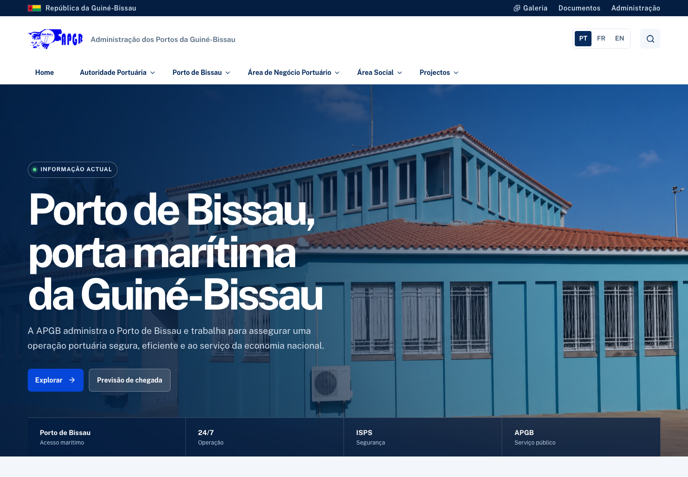
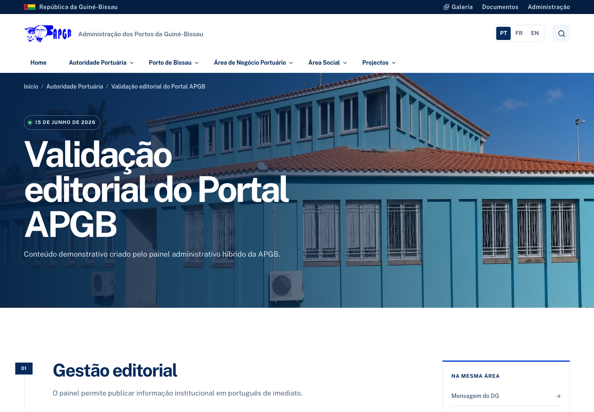
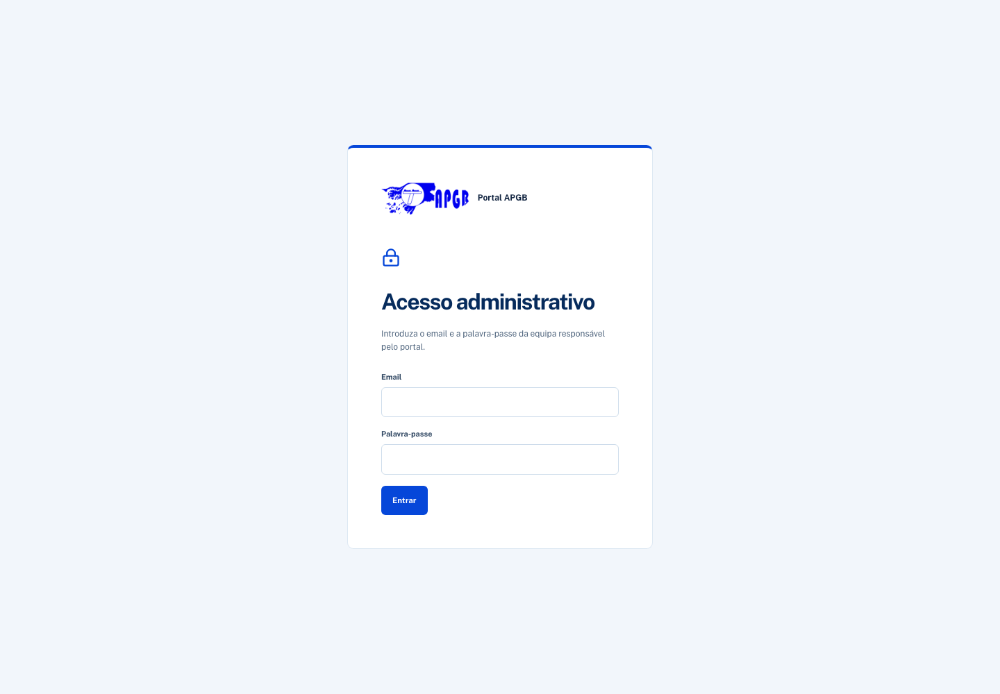
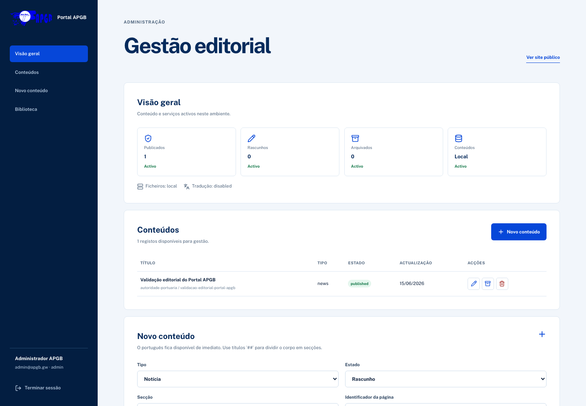
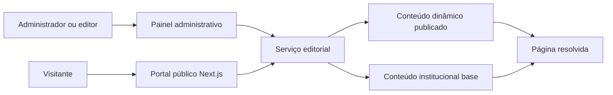
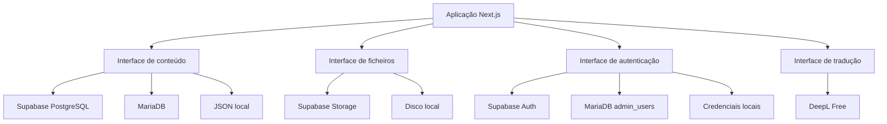

# Portal Institucional APGB

> Administração dos Portos da Guiné-Bissau

Última actualização: 15 de Junho de 2026.

O Portal Institucional APGB reúne informação pública, serviços portuários, projectos, notícias, documentos e galeria da Administração dos Portos da Guiné-Bissau. A aplicação inclui um painel editorial para gerir conteúdos sem alterar o código.

O projecto adopta uma arquitectura híbrida e portátil. Na Vercel, liga ao Supabase. No cPanel, liga à MariaDB e ao disco local. O portal público e o painel administrativo mantêm o mesmo código em ambos os ambientes.

Ambiente de produção: [https://apgb-one.vercel.app/pt](https://apgb-one.vercel.app/pt)

## Visão Geral

O portal foi organizado segundo a estrutura institucional definida pela APGB. A navegação principal separa Autoridade Portuária, Porto de Bissau, Área de Negócio Portuário, Área Social e Projectos. O conteúdo está disponível em português, francês e inglês. Quando uma tradução ainda não existe, o visitante recebe o conteúdo português.

Objectivos principais:

- publicar informação institucional e operacional da APGB
- facilitar o acesso a serviços, regulamentos, tarifas, estatísticas e documentos
- manter fotografias e conteúdos reais do Porto de Bissau
- permitir gestão editorial por administradores e editores
- garantir portabilidade entre Vercel com Supabase e cPanel com MariaDB
- preservar o conteúdo português quando a tradução externa falha

Perfis administrativos:

| Papel | Responsabilidade |
| --- | --- |
| `admin` | Gestão completa de conteúdos, ficheiros, arquivo e remoção |
| `editor` | Criação e edição de conteúdos e ficheiros |

## Capturas

| Página inicial | Página editorial |
| --- | --- |
|  |  |

| Acesso administrativo | Gestão editorial |
| --- | --- |
|  |  |

## Funcionalidades

### Portal público

- página inicial institucional com mensagem do Director-Geral antes dos serviços portuários
- projectos prioritários com destaque para a Dragagem
- navegação multinível segundo o menu oficial da APGB
- páginas institucionais, operacionais, sociais e de projectos
- notícias e destaques editoriais dinâmicos
- galeria fotográfica e documentos para consulta
- imagens de capa associadas à secção e ao conteúdo
- bandeira da Guiné-Bissau no cabeçalho
- favicon e identidade visual APGB
- interface adaptada a computador, tablet e telemóvel

### Gestão editorial

- autenticação por email e palavra-passe
- permissões por papel `admin` e `editor`
- criação de notícias, páginas, projectos, avisos, documentos e galerias
- estados de rascunho, publicado e arquivado
- edição de título, resumo, conteúdo Markdown, secção e identificador da página
- imagem de capa, texto alternativo, galeria e documentos associados
- conteúdos destacados na página inicial
- arquivo lógico e remoção administrativa
- histórico local de versões no adaptador de desenvolvimento
- biblioteca de ficheiros com título e texto alternativo

### Conteúdo híbrido

O conteúdo editorial dinâmico substitui a página estática com o mesmo identificador quando está publicado. Um rascunho não altera o portal público. Um registo arquivado oculta a substituição dinâmica. As páginas base em `src/content/pages.ts` continuam disponíveis como reserva.



### Arquitectura portátil

Os adaptadores são seleccionados por variáveis de ambiente. A aplicação não depende directamente de um fornecedor na camada de apresentação.



## Estrutura Técnica

| Camada | Tecnologia |
| --- | --- |
| Aplicação | Next.js 16, React 19 e TypeScript |
| Estilos | CSS modular por área e sistema visual APGB |
| Conteúdo Vercel | Supabase PostgreSQL |
| Ficheiros Vercel | Supabase Storage |
| Autenticação Vercel | Supabase Auth ou credenciais configuradas |
| Conteúdo cPanel | MariaDB |
| Ficheiros cPanel | Disco local |
| Tradução | DeepL Free com reserva em português |
| Testes | Vitest |
| Qualidade | TypeScript e ESLint |

Pastas principais:

| Caminho | Responsabilidade |
| --- | --- |
| `src/app` | Rotas públicas e painel administrativo |
| `src/components/site` | Componentes visuais do portal |
| `src/content` | Conteúdo institucional base e manifesto de media |
| `src/server/content` | Interfaces e adaptadores editoriais |
| `src/server/media` | Interfaces e adaptadores da biblioteca |
| `src/server/auth.ts` | Sessões, autenticação e permissões |
| `supabase/migrations` | Estrutura PostgreSQL, RLS e perfis administrativos |
| `db/mariadb/schema.sql` | Estrutura MariaDB para cPanel |
| `docs/deployment.md` | Guia operacional de publicação |

## Desenvolvimento Local

Requisitos:

- Node.js 20 ou superior
- npm

Instalação:

```bash
npm ci
cp .env.example .env.local
npm run dev
```

Portal local: [http://localhost:3000/pt](http://localhost:3000/pt)

Painel local: [http://localhost:3000/admin](http://localhost:3000/admin)

No desenvolvimento local, configure uma palavra-passe forte e um segredo de sessão com 32 caracteres ou mais.

## Configuração

Os adaptadores principais são definidos pelas seguintes variáveis:

```env
AUTH_DRIVER=local
CONTENT_DRIVER=local
STORAGE_DRIVER=local
```

Valores suportados:

| Serviço | Adaptadores |
| --- | --- |
| `AUTH_DRIVER` | `local`, `supabase`, `mariadb` |
| `CONTENT_DRIVER` | `local`, `supabase`, `mariadb` |
| `STORAGE_DRIVER` | `local`, `supabase` |

Consulte `.env.example` para a lista completa. Nunca inclua segredos, chaves de serviço ou palavras-passe no repositório.

## Base de Dados

### Supabase

Execute as migrations pela ordem indicada:

```text
supabase/migrations/20260610140000_initial.sql
supabase/migrations/20260615133000_cms_hybrid.sql
```

A migration híbrida acrescenta campos editoriais, biblioteca de ficheiros, perfis administrativos, índices, políticas RLS e permissões.

### MariaDB

Execute:

```text
db/mariadb/schema.sql
```

O esquema inclui conteúdos, traduções, ficheiros, relações editoriais e contas administrativas.

## Publicação

### Vercel com Supabase

1. Crie um projecto Supabase e execute as migrations.
2. Configure as variáveis Supabase, autenticação, conteúdo e armazenamento na Vercel.
3. Defina `CONTENT_DRIVER=supabase` e `STORAGE_DRIVER=supabase`.
4. Execute a publicação pela Vercel.

### cPanel com MariaDB

1. Crie a base de dados MariaDB e execute `db/mariadb/schema.sql`.
2. Configure `CONTENT_DRIVER=mariadb` e `STORAGE_DRIVER=local`.
3. Garanta escrita em `public/uploads` e `data/runtime`.
4. Execute `npm ci` e `npm run build`.
5. Inicie `.next/standalone/server.js` no gestor Node.js do cPanel.

O projecto gera saída `standalone`, adequada ao alojamento Node.js previsto no cPanel.

## Tradução

Novos conteúdos podem ser enviados para DeepL Free quando `DEEPL_API_KEY` está configurada. Sem chave, quota ou resposta do serviço, o conteúdo português continua publicado. A tradução não bloqueia a publicação da fonte.

## Segurança

- sessões assinadas com `AUTH_SECRET`
- validação de dados com Zod
- controlo de acesso por papel no servidor
- palavras-passe MariaDB verificadas com `scrypt`
- chave Supabase de serviço restrita ao servidor
- RLS nas tabelas públicas Supabase
- limites de tamanho e tipo no carregamento de ficheiros
- arquivo lógico para preservar histórico editorial

Antes da entrada em produção, altere as credenciais administrativas, configure HTTPS e confirme as políticas RLS.

## Qualidade

Execute a validação completa:

```bash
npm test
npm run typecheck
npm run lint
npm run build
```

Os testes cobrem selecção de fornecedores, conteúdo híbrido, autenticação, permissões, tradução, repositório editorial e biblioteca local.

## Documentação

- [Plano técnico do CMS híbrido](./docs/superpowers/plans/2026-06-15-apgb-cms-hibrido.md)
- [Guia de publicação](./docs/deployment.md)
- [Produto](./PRODUCT.md)
- [Direcção visual](./DESIGN.md)

## Licença e Propriedade

Projecto institucional da Administração dos Portos da Guiné-Bissau. O conteúdo, a identidade visual e os materiais fotográficos pertencem aos respectivos titulares.
